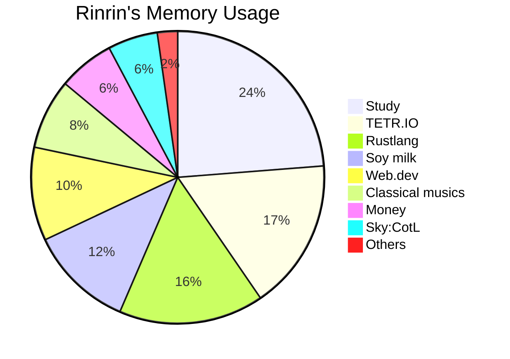

<link href="./style.css" rel="stylesheet"></link>

# ঌ𝓡𝓲𝓷𝓻𝓲𝓷.𝓻𝓼໒

Hi there, I'm a 16year-old S h.s. student <3  
am a low spec fool ('ω' )

---

> Major activities:

- Programming
    - Rustlang 🦀
    - Graphics
    - Web.dev
- TETR.IO
- Sky:CotL 🐦
- Playing & Composing 🎶
    - Piano 🎹
    - Classical
- Digital painting 🎨
- 优秀の人材

---

---

> Languages & Tools:

    &emsp;
    
    
    
    
    
    
    
    
    

---

> Environments:

    &emsp;
    
    
    
    

---

> Contact me:

    &emsp;
    
    
    
    

- Discord: `Rinrin.rs#5671 (724976600873041940)`

---

