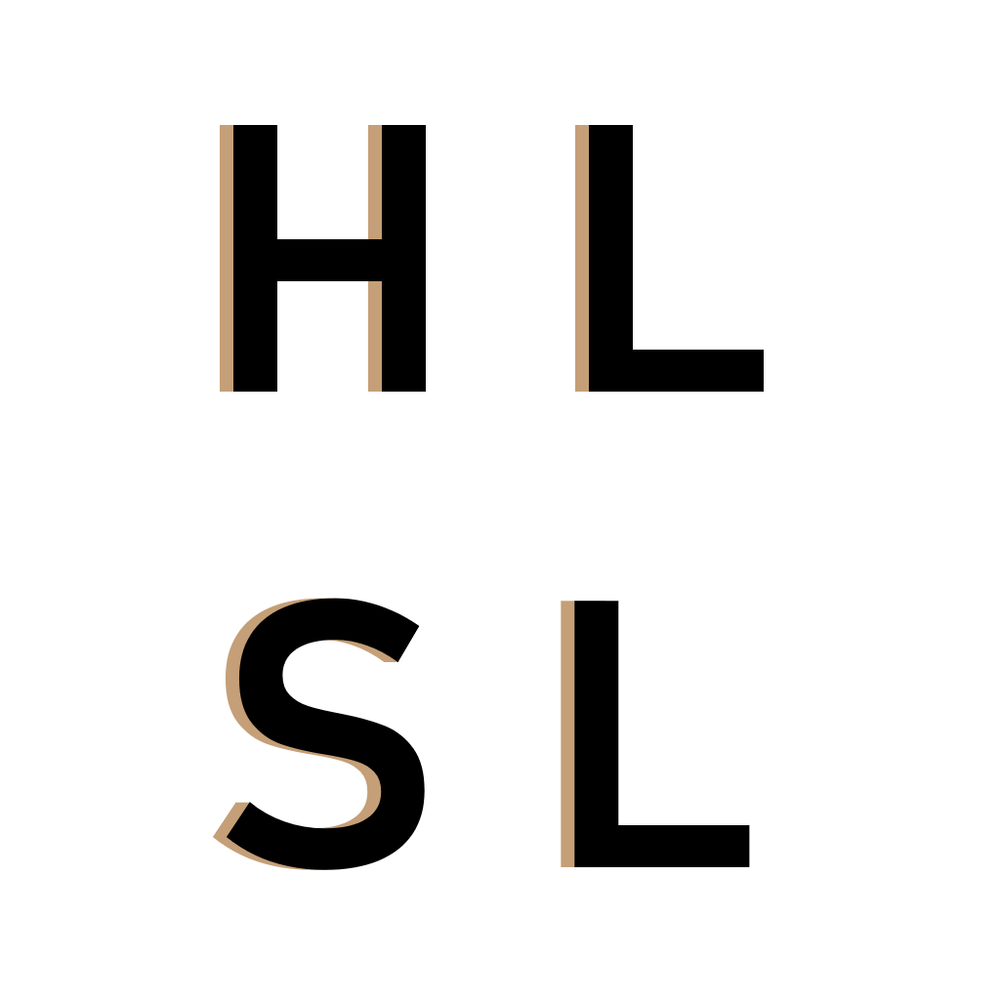
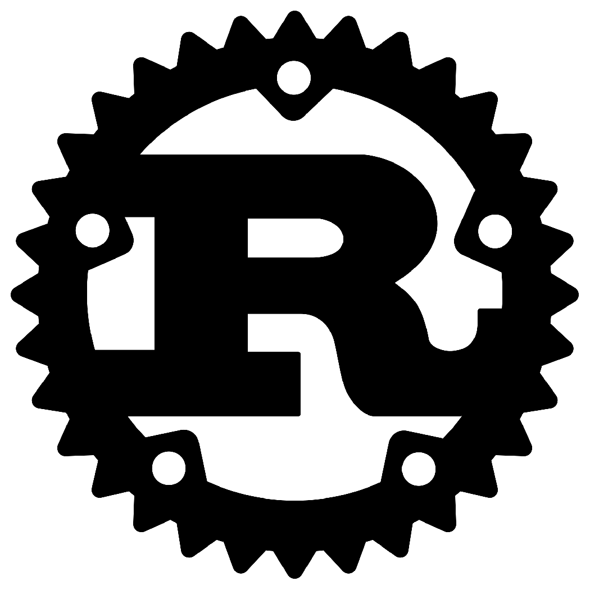
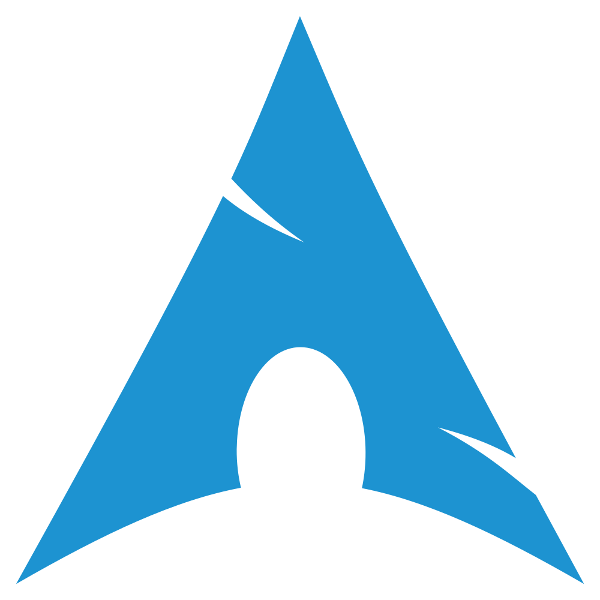
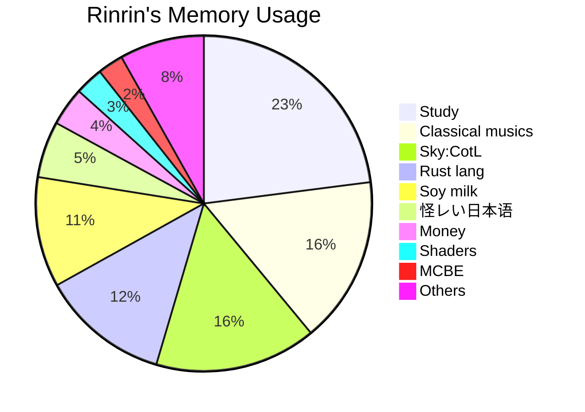

<link href="./style.css" rel="stylesheet"></link>

# ঌ𝓡𝓲𝓷𝓻𝓲𝓷.𝓻𝓼໒

Hi there, I'm a 16year-old S h.s. student:D  
I'm not needed by anyone ( 'ω')

---

> Major activities:

- Programming
    - Web.dev
    - Graphics
    - Rustlang
- SkyCotL 🐦
- Play the piano & Compose 🎹🎶
    - Classical
- ~~(MCBE)~~
- Digital painting 🎨
- 优秀の人材

---

---

> Languages & Tools:

    &emsp;
    
    
    
    
    
    
    
    
    

---

> Environment:

    &emsp;
    
    
    
    
    

---

> Contact me:

    &emsp;
    
    
    
    

- Discord: `Rinrin.rs#5671 (724976600873041940)`

---

