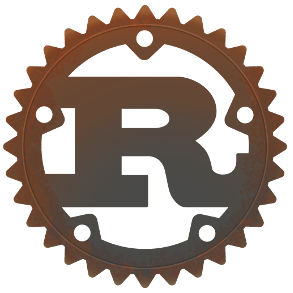
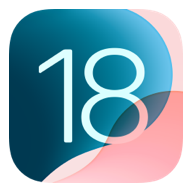
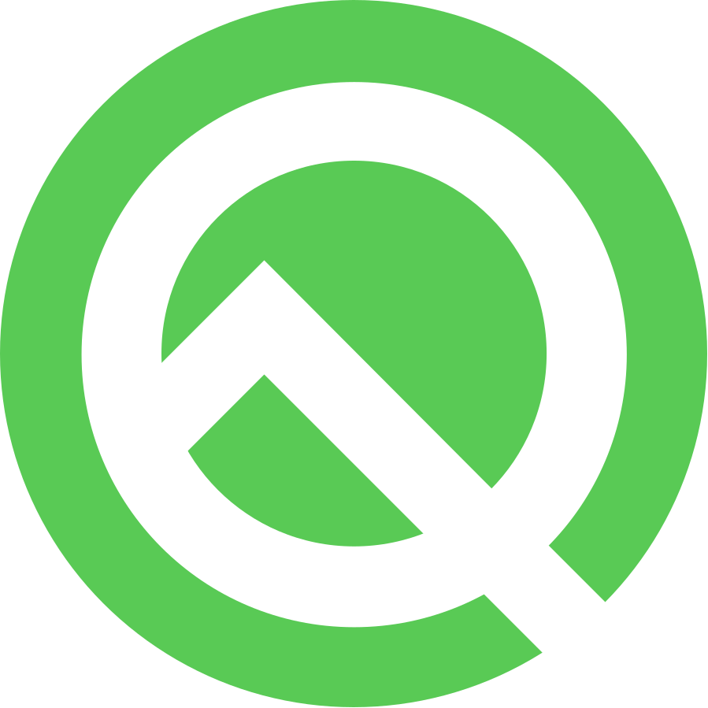
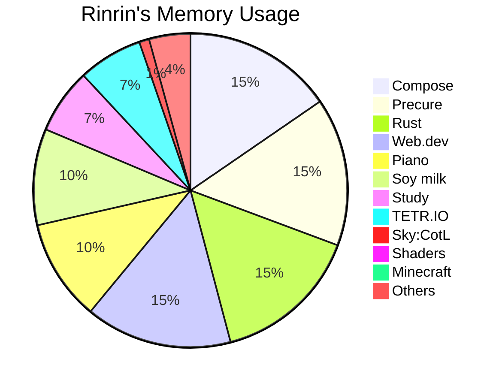

# ঌ𝓡𝓲𝓷𝓻𝓲𝓷.𝓻𝓼໒

Hi there, I'm a 18year-old student;  
am a low spec fool ('ω' )

### Major activities:

- Programming
    - Rustlang 🦀
    - Graphics
    - Web dev.
- Playing & Composing 🎶
    - Piano 🎹
    - Classical music
- Sky:CotL
- Painting 🎨
- 优秀の人材

---

---

### Languages & Tools:

    &emsp;
    &emsp;
    &emsp;
    &emsp;
    &emsp;
    &emsp;
    &emsp;
    &emsp;
    &emsp;
    

---

### Environments:

    &emsp;
    &emsp;
    &emsp;
    &emsp;
    

---

### Contact me:

    &emsp;
    &emsp;
    &emsp;
    &emsp;

- Discord: [`rinrin0413`](https://discord.com/users/724976600873041940)

[more](https://rinrin.pages.dev/social)

---

### My home page:
[rinrin.pages.dev](https://rinrin.pages.dev)

---

